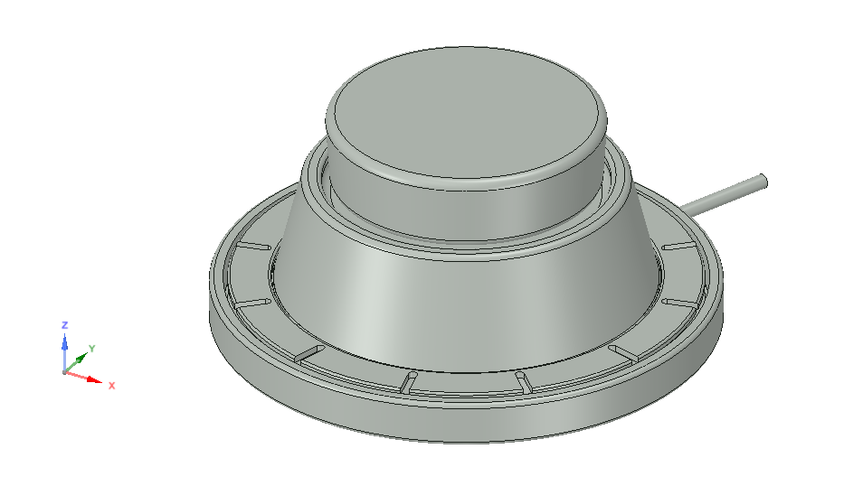

# DIY_3D_Mouse
open source hardware - 3D-Navigation Mouse

Goal:
- low budget mouse for navigation in 3D-programms
- open hardware to support further development

&nbsp;

Features:
- Size 310 x 260 x 280 mm
- Arduino based
- connection via USB

&nbsp;

2018/10/30: Total costs ~25€ plus 3D-printed parts
